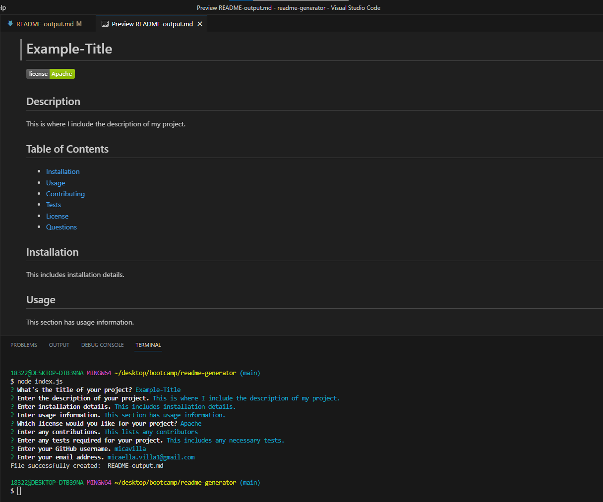

# README-Generator

## Desciption
This command-line application helps creating README files become an efficient and clean process! With this application, the user is prompted to answer questions about what they would like to include in their README file. This includes questions regarding the user's project title, description, installation, usage, license, contributors, tests, and user contact information (GitHub username and email address). Once the user completes answering every question, the application then creates a README file including sections with the data the user provides for each. The application also creates a badge depending on the license the user chooses and a table of contents which links to each corresponding section for the user's accessibility.

## Credit
Thank you to my classmates; Lucas Wysoczanski, Daniel Lee, and Joey Lee; for partnering with me to work on this challenge. Here are their GitHub profiles--
Lucas Wysoczanski: https://github.com/LucasWyski001
Daniel Lee: https://github.com/drog41813
Joey Lee: https://github.com/Rockojoe2

## License
This repository is licensed by MIT. See https://mit-license.org/ to learn more.

## Usage
Walkthrough Video: https://drive.google.com/file/d/1ZZwBRpDN9V90W3aV7HS5kbfBPxdsZkl2/view?usp=sharing

To try this application on your device, git clone and delete example file, README-output.md. Then, open the integrated terminal in your code editor and enter `node index.js` to start the application.

